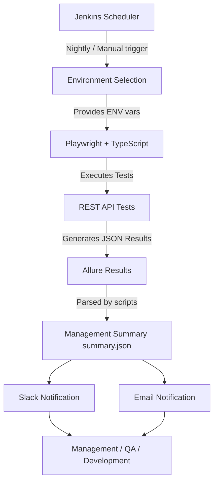

# Enterprise API Automation Framework

## Framework Overview
This is a production-ready enterprise API automation framework built with TypeScript, Node.js, and Playwright. It supports multiple environments, comprehensive REST API testing (GET, POST, PUT, PATCH, DELETE), robust authentication caching, schema validation, API chaining, and extensive reporting via Allure. It is fully integrated with Jenkins for CI/CD and sends notifications to Slack and Email.

### Architecture Diagram


## Prerequisites
- Node.js (v18 or higher)
- npm (v9 or higher)
- Java 8+ (required for generating Allure HTML reports locally)

## Installation
1. Clone the repository and navigate to the root directory.
2. Install dependencies:
   ```bash
   npm install
   ```
3. Install Playwright browsers and OS dependencies (only required for some reporters/networking features):
   ```bash
   npx playwright install --with-deps
   ```

## Configuration

### Environment Setup
Create a `.env` file in the root directory based on `.env.example`:
```bash
cp .env.example .env
```
Update the `.env` file with your specific credentials, API keys, and webhook URLs. **Never commit real secrets to source control.**

### Environments
Supported environments are defined in `src/config/environments.ts`:
- `DEV`
- `QA`
- `UAT`
- `PROD`

## How to Write Tests
Test files should end with `.spec.ts` and be located under the `tests/` directory.

### Using Fixtures
We use custom Playwright fixtures to automatically inject initialized API clients.
```typescript
import { test, expect } from '../../src/fixtures/api.fixture';

test('Should fetch users', async ({ userClient }) => {
  const response = await userClient.getUsers();
  expect(response.status).toBe(200);
});
```

### API Chaining
Example of chaining APIs and schema validation is found in `tests/users/user.crud.spec.ts`.

## How to Run Tests

### Local Execution Example
To run the default test suite against the QA environment directly via command line:
```bash
npx cross-env ENV=QA npx playwright test
```

Or, much easier, just use the built-in npm scripts which automatically handle this:
```bash
npm run test:qa
# For UAT:
# npm run test:uat (if added to package.json)
```

### Run Specific Suites
You can use `grep` to filter tests by tags (e.g., `@smoke`, `@regression`):
```bash
npm run test:smoke
npm run test:regression
```

## How to Generate Allure Reports
After test execution, generate and open the Allure report:
```bash
npm run report
```
This runs: `allure generate allure-results -o allure-report --clean && allure open allure-report`.

## Notifications Setup
Notifications rely on the `summary.json` file generated by `npm run generate-summary`.

### Slack Integration
1. Create an Incoming Webhook in your Slack workspace.
2. Add the URL to `SLACK_WEBHOOK_URL` in `.env`.
3. The script `scripts/slack-notification.ts` parses `summary.json` and posts a rich block message.

### Email Integration
1. Set up SMTP credentials in `.env` (`SMTP_HOST`, `SMTP_PORT`, `SMTP_USER`, `SMTP_PASSWORD`).
2. Set `EMAIL_TO` (comma-separated for multiple recipients).
3. The script `scripts/email-notification.ts` sends an HTML-formatted report.

## Jenkins Setup

### Configure the Jenkins Job
1. Create a new Pipeline job in Jenkins.
2. Under "Pipeline", select "Pipeline script from SCM", choose Git, and provide the repository URL.
3. Script Path: `Jenkinsfile`.

### Configure Credentials
Use Jenkins Credentials Binding plugin to inject secrets securely into the environment block of the `Jenkinsfile` (e.g., `SLACK_WEBHOOK_URL`).

### Daily Scheduling
In the Jenkins Job Configuration, check **Build periodically** and enter a Cron expression:
```
# Run at 10:00 PM IST every day (adjust TZ for Jenkins server)
TZ=Asia/Kolkata
0 22 * * *
```

### Jenkins Parameters
The `Jenkinsfile` defines parameters for manual execution:
- `ENVIRONMENT` (DEV, QA, UAT, PROD)
- `TEST_SUITE` (ALL, SMOKE, REGRESSION)
- `NOTIFY_SLACK` (boolean)
- `NOTIFY_EMAIL` (boolean)

## Coding Standards
- **SOLID & DRY**: Create reusable clients; do not duplicate `fetch()` calls.
- **Strong Typing**: Use TypeScript interfaces for all request and response payloads in `src/types/`.
- **No Hardcoded URLs**: Use `envConfig.baseUrl`.
- **Meaningful Assertions**: Always provide context if an assertion fails (e.g., `expect(response.status).toBe(200)`).
- **Error Handling**: Use `try/catch` and Winston logger in utility methods.

## How to Add a New API Client
1. Create `src/clients/NewDomainClient.ts` extending `BaseApiClient`.
2. Add methods wrapping `this.get()`, `this.post()`, etc.
3. Inject the client into `src/fixtures/api.fixture.ts`.
4. Write tests using the new fixture.
